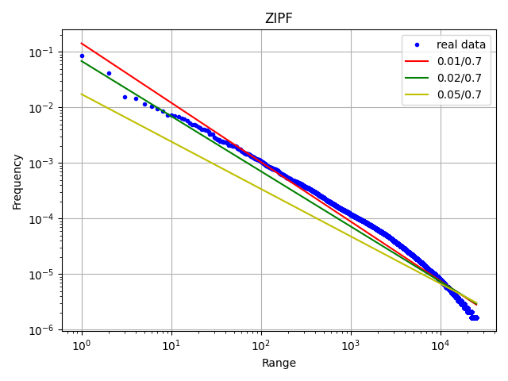
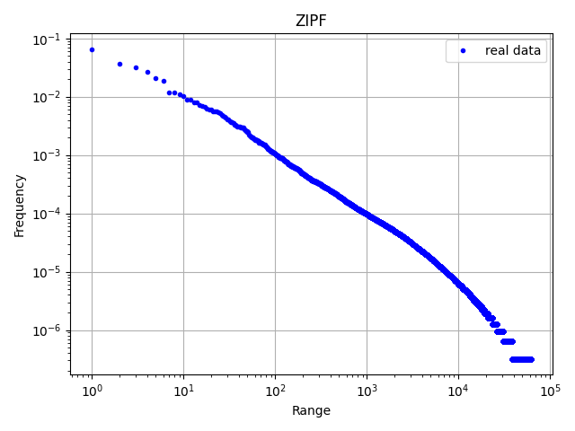
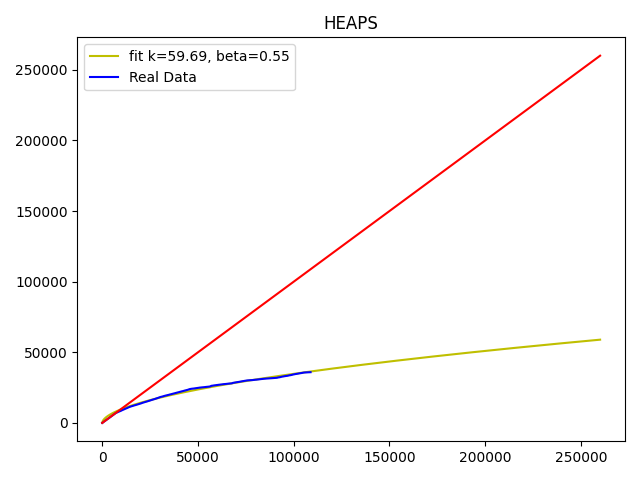
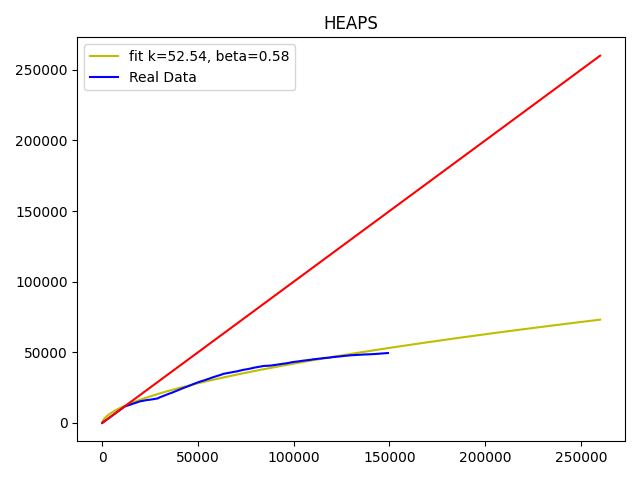
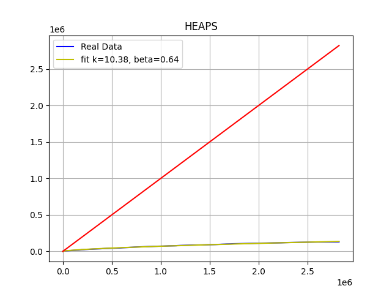

#Sessió 1: ElasticSearch i les lleis de Zipf i Heaps

###Abstract
Per aquesta sessió de laboratori ens hem dedicat a aplicar i comprovar les lleis de *Zipf* i *Heaps* amb l’us de 
l’eina *Elastichsearch* mitjançant el llenguatge de programació *Python*.


La llei de *Zipf*
=================

Dades entrades
--------------

A partir de conjunt de novel·les clàssiques angleses (extretes del [ Gutemberg](https://www.gutenberg.org/)), amb l’eina
 *Elastichsearch* hem introduït un index el qual engloba a tota la col·lecció per tal de poder analitzar la freqüència 
 d’us de totes les paraules empreses per el nostre conjunt de escriptors.

Preprocessament
---------------

Un dels llocs on ens hem centrat ha set en la comoditat al obtenir les dades (donat que els temps per fer indexació dels 
textos es relativament gran) on hem guardat en forma de parells el nombre de repeticions i la paraula en si, directament 
a un fitxer *.csv*.

A més, ens hem dedicat a eradicar mots que no fossen concloents o no existeixin a la llengua anglesa, per exemple, 
diccions que contenien caràcters estranys (tipus ä, accents,...) o que fossin d’una longitud menor de 2 lletres o amb 
un mínim de 4 aparicions en tota la nostra agrupació.

Per últim, al realitzar la crida a la funció on hem aplicat la llei de *Zipf* hem habilitat dos parametres que ens 
permet fer una retallada més exaustiva a les dades d’on extraurem els valors constants, *k* i *alpha*.

Processament de les dades
-------------------------

A la nostra funció ens encarregarem, que donat una llista de les freqüències (prèviament ordenades de major a menor) i 
la mida total de la freqüència. A més com hem explicat abans hem donat la possibilitat de fer un retallament previ al 
(en cas de no donar-li cap valor s’assumeix que es desitja realitzar el calcul de les costant sobre tots els valors).

En primer lloc comprovarem que la resta dels valors a retallar no sigui negativa o 0, donat que es incongruent seguir 
en la tasca.

Desprès realitzarem el logaritme de base 10 a tots els valor del nostre repertori de freqüències i també generarem una
 altra taula amb tots els valors a partir de 1 fins a n (on n es la longitud de la taula freqüències).

Un cop obtingudes aquestes dos conjunts, podem realitzar la línia de regressió per poder obtenir finalment log k 
i alpha mitjançant la comanda *np.polyfit* de la llibreria *numpy*. Donat aquestos valors, l’únic que ens queda 
per fer es aïllar la variable k i alpha.

Per ultim retornem una llista amb les noves freqüències que calculades a partir dels valors obtinguts per la funció.

Resultats
---------

Un cop obtingudes els valors de *aplha* i *k* amb la funció prèviament descrita, realitzarem múltiples gràfiques 
variant la quantitat que hem retallat al fer el calcul. Com podeu observar a les figures adjuntades al text, hem oscil·lat
 entre uns valors de 1-2 % per als mots en una major nombre d’aparicions i un 30-40% per als termes més inferiors.



A més hem aportat imatges on no hem aplicat el preprocesament. Com podeu observar, la separació de punts als dos extrems
 de la funció es molt gran, a més si ens fixem en mes detall, podem observar que a la part inferior de la gràfica podem 
 veure una quantitat molt gran de mots amb una freqüència molt pareguda, per no dir igual.



Per últim hem generat una nova gràfica amb la funció *curvy\_fit* i l’hem comparat amb una de les funcions prèvies que 
trobem que més s’ajusta a la real.
En el nostre cas, hem triat la funció que retallem un 1% dels superiors amb un 30% dels valors inferiors.

Com podem observar, la nostra recta s’aproxima molt millor a la funció descrita per el conjunt que no pas la generada 
per *curvy\_fit*


Conclusions
-----------

Gracies a aquesta llei, podem observar quins mots son els més freqüents dintre del nostre idioma (sempre i quant la 
col·lecció sigui significativa), quins termes poden ser més efectius al realitzar una cerca per la web, a més el podem
 utilitzar per avaluar algun text nostre per comprovar si el nostre vocabulari i domini d’una llengua es ric 
 (si la recta es molt curta o amb molta pendent utilitzem molt sovint les mateixes paraules).

Al realitzar els càlculs per poder extreure les constants ens hem adonat conte de la quantitat de paraules que s’
utilitzem molts pocs camins (les quals ens generaven distorsions per a les rectes de regressions calculades), donat que 
hem tingut que retallar en alguns casos per poder obtenir uns valors que s’apareguessin als del index d’un 30%.

Llei de *Heaps*
===============

Dades entrades
--------------

Per aplicar la llei de Heaps hem utilitzar el mateix conjunt de dades que amb la llei de Zepf per tal de poder aplicar 
una conclusió conjunta de tal forma que hem utilitzat el conjunt de novel·les clàssiques angleses, però en aquest cas, 
per a poder observar millor l’afecte de la llei, hem dividit el conjunt de novel·les en dos subconjunt per a poder
 comparar el resultat amb el conjunt total.

Preprocessament
---------------

Utilitzant l’*Elastichsearch* hem creat dos índexs nous, els quals cada un apunta a un subconjunt de novel·les, per
 poder analitzar cada blocs per separats.

A continuació anirem recorrent les novel·les de cada un dels índexs guardant les paraules noves que van apareixent 
en una llista per tal de poder tractar-les i representarles a continuació.

Processament de les dades
-------------------------

Un cop es te la llista amb les paraules noves que han anat apareixent podem aplicar la funció *curve fit* que en dona
 la llibreria *scipy* per a obtenir la predicció de *k* i *beta* en relació a al subconjunt elegit a partir de la 
 llei de Heaps. 
 ```
F = k * N^beta
 ```
 Aquesta predicció la podem aplicar amb els dos subconjunts de novel·les i amb el 
 conjunt complet per tal d’observar si els resultats s’ajunten a la realitat i poder prendre per bons els valors de 
 *k* i *beta*.

Resultats
---------

Al obtenir les prediccions de *k* i *beta* podem observar si la curava resultant s’ajusta a la realitat, per a fer
 aquesta comprovació representarem gràficament els resultats obtinguts per a comprovar visualment la validesa dels resultats.





Com es pot observar, en la figura1 respecte a la figura2, el *beta* es de poques 
centèsimes més elevat que en el segon subconjunt, una diferencia molt baixa, es a dir que podem veure com la corba 
s’ajusta al resultats reals obtinguts.


Si extrapolem el resultat de les dues figures anteriors i els anem ajuntant paraula per paraula podem veure com el 
resultat obtingut del conjunt complet de novel·les s’ajunta a es prediccions obtingudes anteriorment de *k* i *beta*,
 de tal forma que podem acceptar i prendre com a bones aplicant un petit factor d’error.



Pes a poder donar com a valid el nostres resultats hem realitzat un nou estudi sobre un conjunt diferent i amb un major
 nombre de paraules. El resultat dels valor *k* i *beta* aconseguit amb el nou conjunt son molts semblants als valors 
 obtinguts amb el conjunt complet de novel·les.

Conclusions
-----------

Ara que ja podem verificar que la llei de *Heaps* s’adapta a la realitat i tenim els paràmetres adequats podem aplicar 
la llei i obtindre quantes paraules diferents esperem obtenir a partir d’un conjunt de *X* paraules. Aquesta informació
 pots ser molt important a l’hora de per exemple indexar pagines web a google...
